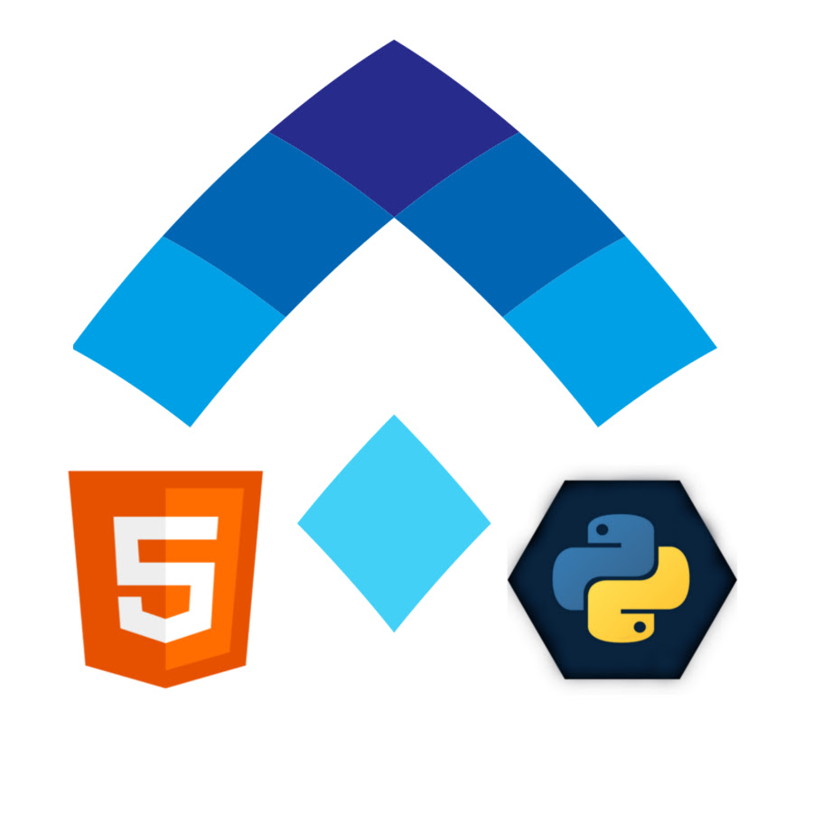

# 1. Markdown. HTML & CSS

> [Посещаемость](https://docs.google.com/spreadsheets/d/1j4gs3pkUa1UzIJYNShX3-2LFpUy7Nx6oyAE9y8TyVEU/edit#gid=993317728)

## Git & (GitHub|GitLab)

1. [Гитхаб как хостинг (HTML Academy)](https://htmlacademy.ru/blog/boost/tools/github-as-hosting)

## HTML

- [Простые правила разметки](https://yoksel.github.io/easy-markup/)

Инструменты:

1. [Обзор Chrome DevTools. Решаем основные задачи разработчика (HTML Academy)](https://htmlacademy.ru/blog/boost/tools/how-to-devtools)
2. [Введение в Chrome DevTools. Панель Elements (HTML Academy)](https://htmlacademy.ru/blog/boost/tools/chrome-devtools-1)
3. [Введение в Chrome DevTools. Console, Sources, Network (HTML Academy)](https://htmlacademy.ru/blog/boost/tools/chrome-devtools-2)

- [Зачем нужны заголовки и какие теги использовать (HTML Шорты)](https://htmlacademy.ru/blog/boost/frontend/short-7)
- [Спецификация W3C или WHATWG (HTML Шорты)](https://htmlacademy.ru/blog/boost/frontend/short-11)

## CSS

- [Текущая спецификация](https://www.w3.org/TR/CSS/)
- Селекторы
    - [Комбинаторы](https://developer.mozilla.org/ru/docs/Learn/CSS/Building_blocks/Selectors/Combinators
- [GRID](https://grid.malven.co/)

## Python

__Питон__ был _назван_ в честь __*теле-шоу*__ "**Монти** *Пайтона*".

Функция `split()`.

```python
def hello(word:str):
    pass
```



[ссылка на википедию](http://wiki.osdev.org/)

### Django

## JavaScript

```javascript
function hello_js(word) {

}
```

### React

### Redux
